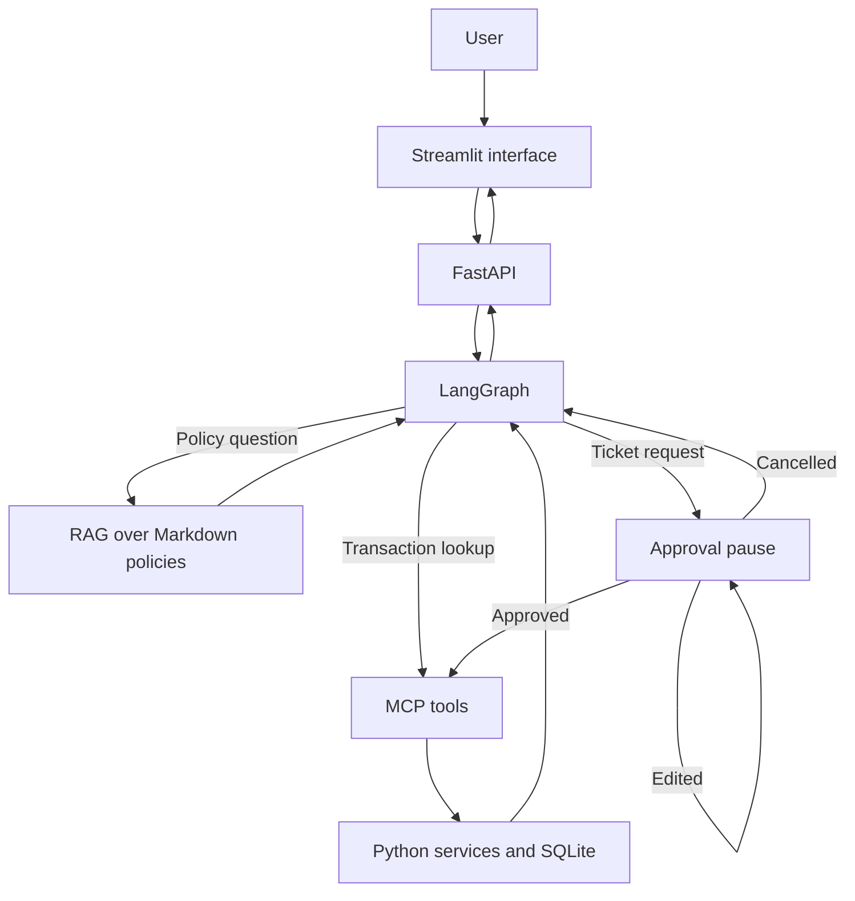

# ResolveAI — Product Brief

**Document type:** Product definition and implementation reference  
**Status:** Initial prototype specification

## 1. Product summary

ResolveAI is a bilingual payment-support assistant that answers payment-policy questions, checks synthetic transaction information, and creates support tickets only after the user explicitly approves the action.

The initial prototype supports English and Hindi/Hinglish. It uses only fake policies and synthetic transaction data. It does not connect to a real bank, payment gateway, customer account, or support platform.

## 2. Problem being solved

Customers often contact payment support for three repetitive reasons:

1. They want to understand a payment rule, such as how long a failed-payment reversal takes.
2. They want to know what happened to a particular transaction.
3. They want support to investigate an unresolved problem.

ResolveAI demonstrates how one assistant can handle these requests safely. It answers rules using approved policy text, reads transaction facts from a data source, and asks for permission before creating anything.

## 3. Purpose of this document

This document removes ambiguity before development begins. It defines exactly:

- what the demo supports;
- what the user says and sees;
- what happens internally;
- which information is fake;
- when approval is required;
- what Approve, Edit, and Cancel mean;
- which future component owns each responsibility; and
- what the project intentionally does not support.

It is written for developers, recruiters, product reviewers and other stakeholders. A developer should be able to implement the prototype from it, while a reviewer should be able to understand the problem, behaviour, design boundaries and safety decisions.

## 4. Important concepts

### 4.1 Policy knowledge

Policy knowledge describes the company's rules and guidance. It applies broadly and is not the status of one specific customer's transaction.

Example:

> A failed payment is normally reversed within 3–5 business days.

For the prototype, policies will be stored as Markdown documents. In a later phase, RAG will search those documents and return the relevant text with a citation.

### 4.2 Operational data

Operational data describes a particular transaction or support ticket.

Example:

```json
{
  "transaction_id": "TXN-1002",
  "status": "FAILED",
  "failure_reason": "BANK_DECLINED"
}
```

For the prototype, this data will eventually be stored in SQLite. Looking it up is a read operation: it observes existing information but does not change anything.

### 4.3 Write action

A write action creates or changes stored data.

Example:

> Create a support ticket for TXN-1002.

Ticket creation is a write action because it inserts a new ticket. ResolveAI must never perform this action merely because it believes the user intends it. It must first display the proposed action and wait for an explicit Approve decision.

| Information type | Example | Future source/component | Changes data? | Approval needed? |
|---|---|---|---:|---:|
| Policy knowledge | Reversal takes 3–5 business days | Markdown policies and RAG | No | No |
| Operational data | TXN-1002 is FAILED | SQLite through an MCP read tool | No | No |
| Write action | Create a support ticket | MCP write tool and SQLite | Yes | Yes |

## 5. Demo data

All records in this document are synthetic and exist only for demonstration.

### 5.1 Failed-payment policy

```yaml
title: Failed Payment Policy
version: 1.0
effective_date: 2026-09-01
section: Reversal Timeline
rule: A failed payment is normally reversed within 3–5 business days.
```

This rule describes the normal reversal timeline. It does not guarantee that a particular transaction has already been reversed.

### 5.2 Transaction

```json
{
  "transaction_id": "TXN-1002",
  "status": "FAILED",
  "failure_reason": "BANK_DECLINED",
  "amount": 2500.00,
  "currency": "INR",
  "created_at": "2026-09-15T10:30:00Z"
}
```

The full ID may be used internally for lookup. User-facing responses, approval cards, logs, and traces should show the masked form `TXN-****002`.

### 5.3 Ticket created after approval

```json
{
  "ticket_id": "TKT-5001",
  "transaction_id": "TXN-1002",
  "issue": "Failed payment reversal",
  "status": "OPEN"
}
```

This ticket must not exist before the user approves its creation.

## 6. Supported conversation 1 — Policy question

### User goal

The user wants to understand the normal reversal timeline for a failed payment. They are not asking about a particular transaction.

### Exact conversation

**User**

> How long does a failed payment reversal take?

**Expected assistant response**

> A failed payment is normally reversed within 3–5 business days.
>
> Source: Failed Payment Policy — Reversal Timeline, version 1.0.

### What the user sees

- A concise answer.
- A visible source title and section.
- An expandable citation containing the supporting policy text.

### What happens internally in the completed system

1. The application receives the message and session ID.
2. LangGraph classifies the request as `POLICY_QUESTION`.
3. RAG searches approved Markdown policy documents.
4. The Failed Payment Policy's Reversal Timeline section is retrieved.
5. The LLM generates an answer using only the retrieved evidence.
6. The application returns the answer and citation.

### Acceptance checks

- The response states `3–5 business days`.
- The response cites `Failed Payment Policy` and `Reversal Timeline`.
- The response does not claim that a specific transaction has been reversed.
- If relevant evidence cannot be found, the assistant says: `I don't have enough policy information to answer that.`
- No transaction or ticket tool is called.

## 7. Supported conversation 2 — Transaction lookup

### User goal

The user wants the current status of one synthetic transaction.

### Exact conversation

**User**

> Check TXN-1002.

**Expected assistant response**

> Transaction TXN-****002 has FAILED. The failure reason is BANK_DECLINED. According to the Failed Payment Policy, a failed payment is normally reversed within 3–5 business days.
>
> Source: Failed Payment Policy — Reversal Timeline, version 1.0.

### Reference data and expected interpretation

Before the database is implemented, use this JSON object as the authoritative example record:

```json
{
  "transaction_id": "TXN-1002",
  "status": "FAILED",
  "failure_reason": "BANK_DECLINED"
}
```

The application will eventually read these fields from SQLite and construct the expected response. Until then, this record defines the required lookup behaviour.

### What the user sees

- Masked transaction ID: `TXN-****002`.
- Status: `FAILED`.
- Failure reason: `BANK_DECLINED`.
- The normal policy timeline and its citation.

### What happens internally in the completed system

1. The application extracts `TXN-1002` from the message.
2. LangGraph classifies the request as `PAYMENT_STATUS`.
3. The MCP client calls `get_transaction_status(transaction_id="TXN-1002")`.
4. The MCP server calls the payment service.
5. The payment service reads the synthetic SQLite record.
6. The application stores `TXN-1002` as the current transaction in this conversation session.
7. RAG retrieves the applicable reversal policy.
8. The assistant combines the transaction facts with the policy guidance without changing either.
9. The response masks the transaction ID before displaying it.

### Acceptance checks

- The system returns `FAILED` and `BANK_DECLINED`.
- It shows `TXN-****002`, not the full transaction ID, in its response.
- It remembers `TXN-1002` as the current transaction for the next turn.
- It does not create a ticket.
- It does not claim to have initiated or completed a refund.

## 8. Supported conversation 3 — Approval-gated ticket creation

### User goal

After discussing `TXN-1002`, the user wants support to investigate the issue.

### Exact conversation

**User**

> Create a ticket for it.

Here, `it` means the transaction discussed earlier: `TXN-1002`.

**Expected system response before creation**

```text
Approval required

Proposed action: Create support ticket
Transaction: TXN-****002
Issue: Failed payment reversal

[Approve] [Edit] [Cancel]
```

At this point, no ticket has been created.

### Approve behaviour

When the user clicks **Approve**:

1. The application resumes the same conversation/graph session.
2. It verifies that the approval belongs to the pending proposed action.
3. It calls the MCP `create_support_ticket` write tool once.
4. The tool creates the synthetic ticket.
5. The application returns:

> Ticket TKT-5001 was created successfully for TXN-****002.

The ticket ID may only be displayed after successful creation.

### Edit behaviour

When the user clicks **Edit**:

1. The application displays an editable issue field.
2. The user changes the description, for example to `Failed payment reversal not received after five business days`.
3. The application displays the updated proposal.
4. The user must still click **Approve** before the ticket is created.

Editing a proposal is not approval and must not create a ticket.

### Cancel behaviour

When the user clicks **Cancel**:

1. The pending action is discarded.
2. No ticket is inserted.
3. The application returns:

> Ticket creation was cancelled. No ticket was created.

### Repeated approval behaviour

If the same approval request is submitted twice—for example, because the user double-clicks or the network retries—the system must return the existing ticket rather than creating a duplicate. A unique idempotency key will protect this operation in a later phase.

### What happens internally in the completed system

1. LangGraph classifies the message as `CREATE_TICKET`.
2. Conversation memory resolves `it` to `TXN-1002`.
3. The graph prepares a proposed action.
4. The graph interrupts before the write tool is called.
5. The frontend shows the approval card.
6. Approve, Edit, or Cancel is sent back with the same session/thread ID.
7. Only an approved action reaches the MCP write tool.
8. The tool calls the ticket service, which writes to SQLite.

### Acceptance checks

- The system correctly resolves `it` to the previously discussed transaction.
- The proposal displays the masked transaction ID and issue.
- No database write occurs before approval.
- Approve creates exactly one ticket.
- Edit changes the issue but still requires approval.
- Cancel creates nothing.
- Replaying the same approval cannot create a duplicate ticket.
- A forged or unrelated approval is rejected.

## 9. Meaning of “create a ticket for it”

This phrase relies on conversation memory:

- `create a ticket` expresses the requested action;
- `it` refers to the transaction most recently discussed in the same session;
- in the required demo, that transaction is `TXN-1002`.

If no transaction has been discussed, the assistant must not guess. It should ask:

> Which transaction should I create the ticket for? Please provide the transaction ID.

## 10. Future component responsibilities

| Component | Responsibility | Must not do |
|---|---|---|
| Streamlit frontend | Display messages, citations and approval controls; collect text/voice and decisions | Decide transaction facts or bypass approval |
| FastAPI | Provide HTTP endpoints, validate requests and return structured responses | Contain all business logic directly in route functions |
| LangGraph | Route requests, maintain conversation state, pause and resume write actions | Directly manipulate the database |
| Policy RAG | Retrieve relevant policy text and metadata | Invent policy rules |
| LLM | Classify intent and phrase answers from supplied evidence | Act as the source of transaction truth |
| MCP client | Discover and invoke approved operational tools | Execute unregistered tools |
| MCP server | Expose typed transaction-read and ticket-write tools | Allow writes without server-side validation |
| Payment service | Apply transaction lookup business logic | Generate policy answers |
| Ticket service | Validate and create idempotent tickets | Create a ticket for an unknown transaction |
| SQLite | Persist synthetic payments, conversation checkpoints and tickets | Store real customer or banking information |
| ElevenLabs adapter | Convert speech to text and responses to audio | Become the source of truth; text remains authoritative |
| Guardrails | Validate inputs, redact sensitive values and block unsafe actions | Silently change genuine transaction facts |
| Evaluation and tracing | Measure routing, citations, tools, approval and latency | Store secrets, raw audio or unnecessary personal data |

## 11. High-level architecture



For the future voice flow, speech-to-text runs before the message enters FastAPI, and text-to-speech runs after the final text response is produced. The underlying agent flow remains the same.

## 12. Supported scope

The initial demo supports only:

- English and Hindi/Hinglish text or voice input;
- answering approved payment-policy questions with citations;
- looking up synthetic payment information;
- remembering the current transaction within a session;
- proposing a support ticket;
- approving, editing, or cancelling that proposal; and
- creating a synthetic ticket after valid approval.

## 13. Out of scope

The initial demo will not:

- connect to a real bank, payment gateway or support platform;
- access or store real customer information;
- move money;
- initiate, approve or execute refunds;
- modify a payment status;
- provide financial or legal advice;
- create tickets autonomously;
- support every possible payment-support conversation;
- build a complete call-centre platform;
- train a new AI model; or
- claim to be a production banking integration.

For unsupported requests, the assistant should clearly explain what it cannot do and guide the user toward one of the supported journeys when appropriate.

## 14. Failure and clarification behaviour

| Situation | Expected behaviour |
|---|---|
| Transaction ID is missing | Ask the user to provide it |
| Transaction does not exist | Say that no matching synthetic transaction was found |
| Policy evidence is missing | Say there is not enough policy information |
| User asks to issue a refund | Refuse because refund execution is unsupported |
| User asks to create a ticket without prior transaction context | Ask which transaction the ticket is for |
| User cancels a proposed ticket | Discard the proposal and create nothing |
| Tool temporarily fails | Explain that the operation could not be completed and offer a safe retry |
| Voice fails | Keep the text interface usable |

## 15. End-to-end reference flow

The following is the primary end-to-end behaviour the prototype must support:

1. User asks: `My payment TXN-1002 failed. When will I get the money back?`
2. The transaction lookup returns `FAILED` and `BANK_DECLINED`.
3. The policy lookup returns the `3–5 business days` rule.
4. The assistant shows the masked transaction details, policy guidance and citation.
5. User says: `Create a support ticket for it.`
6. The system resolves `it` to `TXN-1002`.
7. The system displays the approval card; it creates nothing yet.
8. User selects Approve.
9. The ticket service creates `TKT-5001` once.
10. The assistant confirms successful ticket creation.

## 16. Product acceptance criteria

The initial prototype is considered complete when all of the following are true:

- A policy question returns an answer supported by the correct policy citation.
- `Check TXN-1002` returns the masked ID, `FAILED` status and `BANK_DECLINED` reason.
- The assistant remembers `TXN-1002` when the user subsequently says `Create a ticket for it`.
- A ticket proposal is displayed before any write occurs.
- Approve creates exactly one ticket and returns its ticket ID.
- Edit changes the proposed issue and still requires approval.
- Cancel creates no ticket.
- Repeated approval does not create duplicate tickets.
- Unsupported or unsafe requests are refused clearly.
- Full transaction identifiers are not exposed in user-facing responses or logs.
- The three supported conversations work end to end through the user interface.
